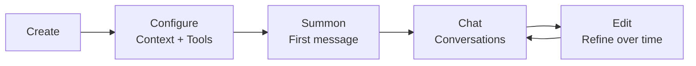

# Agent

## What is agent ?
- agent has these four things:
	- LLM - The large language model that provides reasoning ~ the brain
	- Context files - Markdown files that define personality, knowledge, rules
	- Tools - What agents can do ~ the ability
	- Memory - Long-term facts shared across sessions
- four things equal to four characteristics:
	- Able to think what to do with reason
	- Able to be instructed
	- Able to perform with taught actions
	- Able to remember their thought and action result

-> a machine `think` then `act` autonomously with `what they can` by `what they know` ``

## Agent lifecyle

## Agent loop
- receive
- think
- execute tool
- repeat 2 and 3
- return result

# Context File
- markdown file
	- why? 
		- add label to text to agent parse easier (header with ## means all contents under it is belong to same topic)
- 

## Questions
### What makes this agent superior than other ?
- design the agent loop ?
- design the memory retrieval ?